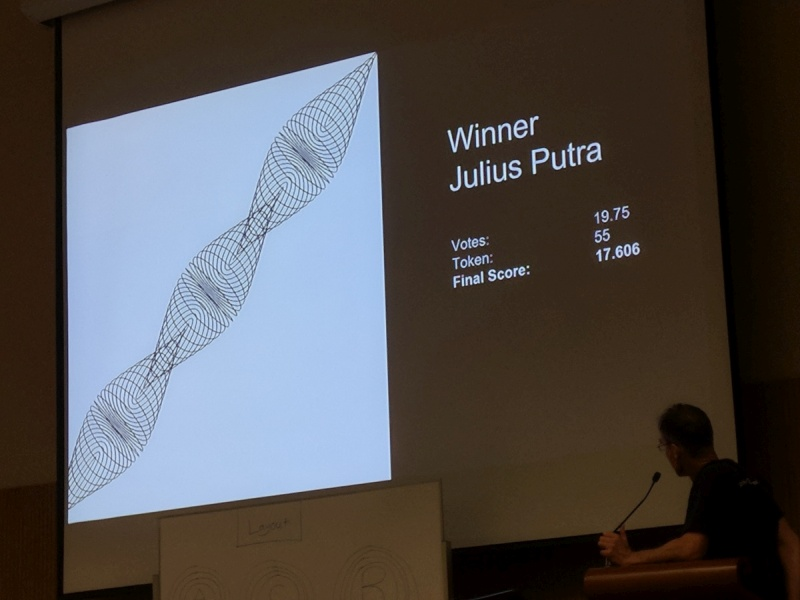
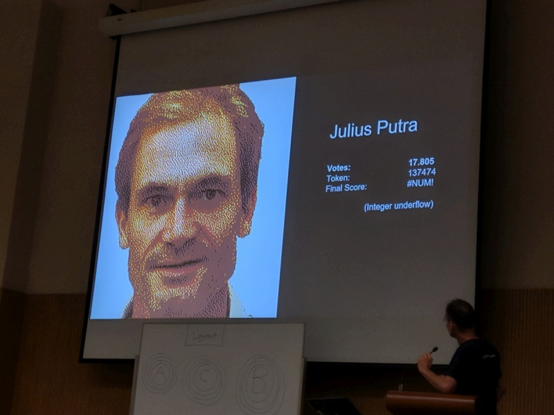
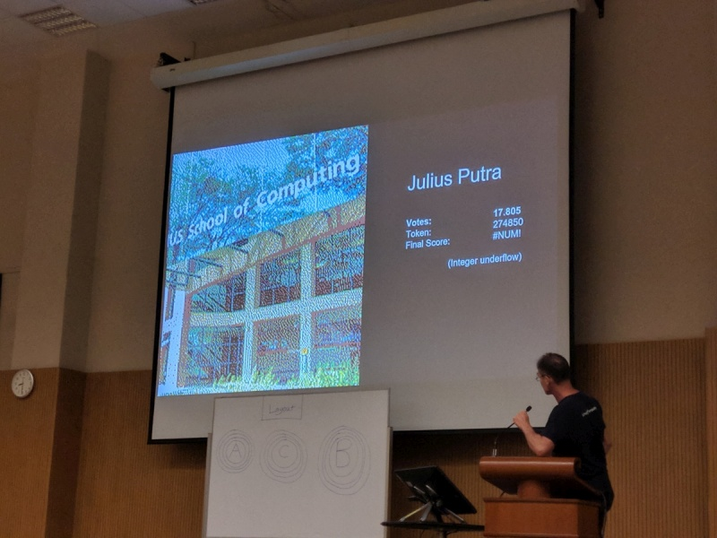
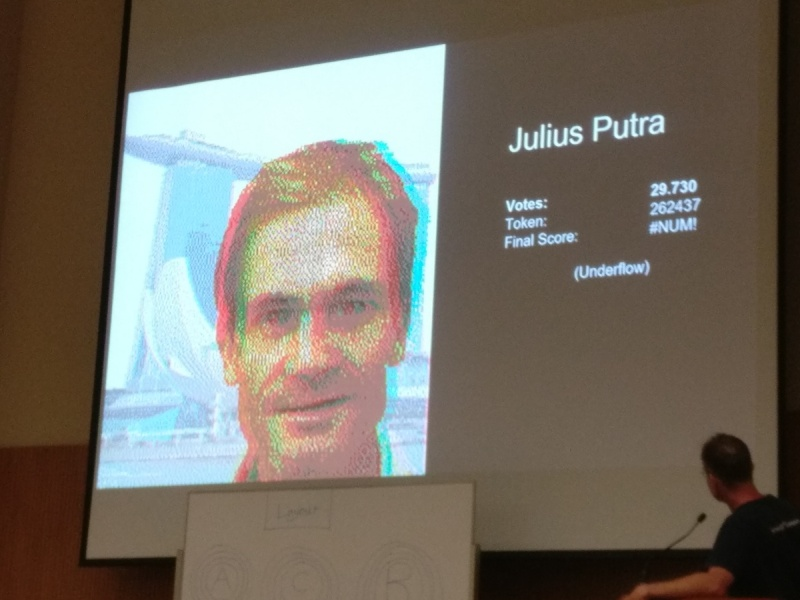
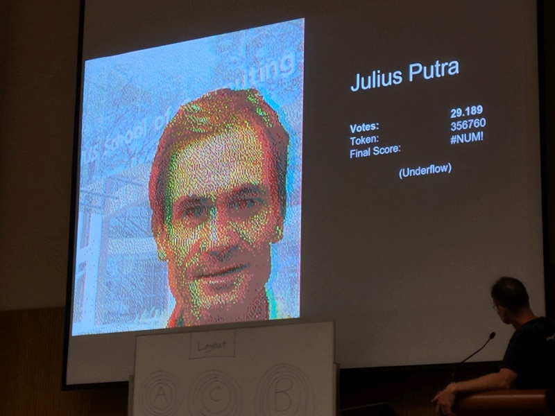
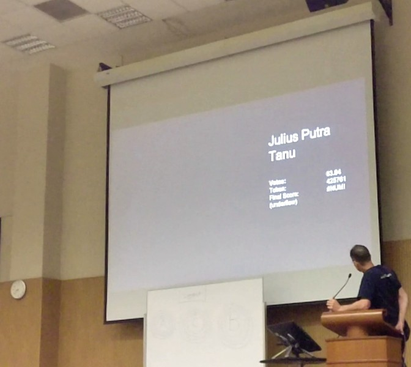

# CS1101S-indocomsoft

These are my code submissions for my [CS1101S](http://www.comp.nus.edu.sg/~cs1101s/) Programming Methodology module during my undergraduate study in National University of Singapore (NUS), School of Computing (SoC) for B.Comp (Honours) in Computer Science.

CS1101S is based on Massachussetts Institute of Technology (MIT) introductory programming class 6.001 and its textbook [Structure and Interpretation of Computer Programs (SICP)](https://en.wikipedia.org/wiki/Structure_and_Interpretation_of_Computer_Programs)

Language used is the Source, a subset of Javascript. The language evolves to be broader and broader as weeks go on. Check out the specifications [here](The Source specification)

## Contest Results
### Winner for
1. One entry in **Contest 7.1 Curves**

2. **Contest 13 Sumobot**

 * More information on my [CS1101S-sumobot repository](https://github.com/indocomsoft/CS1101S-sumobot)
 * Watch the Final matches [here](https://www.youtube.com/playlist?list=PLqGbHSZjzsVuP_jthmPlTpyrYn31zvIH7)

### Most popular for:
1. Two entries in **Contest 2.2 2D runes**

2. Two entries in **Contest 3.2 3D runes**

3. **Contest 10.3 Sound**

 * Click [here](Contest/Contest-10.3.wav) to hear my entry.
 * CS1101S Reaction to the entry:
